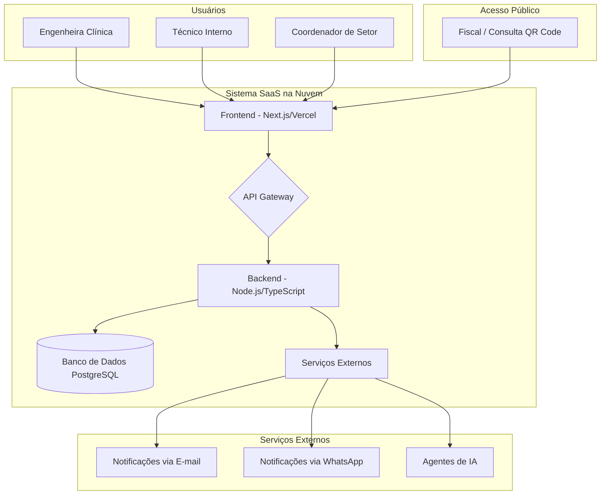

# PRD: Sistema de Gestão para Engenharia Clínica

**Autor:** Manus AI
**Versão:** 1.0
**Data:** 26 de Janeiro de 2026

---

## 1. Introdução

### 1.1. Contexto

Atualmente, clínicas e hospitais de pequeno e médio porte, como o HCAN, realizam o gerenciamento de seu parque tecnológico de equipamentos médicos de forma manual, utilizando planilhas de Excel e pastas no Google Drive. Este método, embora funcional, é propenso a erros, centraliza a informação em um único profissional (a engenheira clínica), dificulta o acesso rápido a dados críticos e não oferece uma visão estratégica para a tomada de decisão, como a análise de custo-benefício para a substituição de um equipamento.

### 1.2. Problema

A gestão manual resulta em:

- **Centralização excessiva:** A informação fica dependente de um único profissional, criando um gargalo em auditorias e fiscalizações.
- **Falta de agilidade:** A dificuldade em acessar o histórico completo de um equipamento (calibrações, manutenções corretivas, custos) atrasa decisões importantes.
- **Risco de não conformidade:** O controle de vencimentos de calibrações e testes de física médica é visual e sujeito a falhas, aumentando o risco de multas e sanções pela vigilância sanitária.
- **Ausência de dados estratégicos:** É impossível mensurar o custo total de um equipamento ao longo de sua vida útil, dificultando a decisão entre consertar ou substituir.
- **Comunicação ineficiente:** A abertura e o acompanhamento de chamados de manutenção corretiva são feitos em sistemas separados (MV), sem integrar o histórico ao equipamento.

### 1.3. Objetivo

Desenvolver um **sistema web centralizado** que automatize e otimize a gestão do parque tecnológico de engenharia clínica, tornando o processo mais **eficiente, transparente e estratégico**.

### 1.4. Visão Geral da Solução

O sistema será uma plataforma web que permitirá o cadastro e o gerenciamento completo de todos os equipamentos médicos. Através de uma interface simples, os usuários poderão controlar o inventário, agendar e registrar manutenções preventivas (calibrações) e corretivas, gerenciar os testes de física médica, e acessar o histórico completo de cada ativo. O sistema contará com um dashboard com indicadores chave, um sistema de alertas automáticos (via sistema, e-mail e WhatsApp) para vencimentos, e a geração de etiquetas com QR Code para acesso instantâneo às informações do equipamento. Além disso, agentes de Inteligência Artificial auxiliarão na análise de dados para decisões estratégicas.
_
_

## 2. Perfis de Usuário e Permissões

O sistema terá quatro perfis de usuário distintos, com permissões específicas para garantir a segurança e a eficiência operacional. O perfil **Engenheira Clínica Master** terá a capacidade de customizar e restringir o acesso de cada usuário, incluindo a definição de quais unidades de produção (hospitais, clínicas) cada um poderá visualizar.

| Perfil | Descrição | Permissões Chave |
| :--- | :--- | :--- |
| **Engenheira Clínica Master** | Administrador geral do sistema. | - **Controle Total:** Criar, editar, visualizar e excluir tudo (equipamentos, usuários, unidades, relatórios). - **Configuração:** Definir permissões para outros perfis. - **Gestão de Unidades:** Atribuir usuários a unidades específicas. |
| **Técnico Interno** | Executa as manutenções. | - **Gestão de Ordens de Serviço:** Atender, registrar e fechar chamados (corretivas e preventivas). - **Atualização de Equipamentos:** Alterar status, adicionar fotos e anexar documentos (certificados, relatórios). - **Visualização:** Consultar o histórico e a agenda de manutenções. |
| **Coordenador de Setor** | Gestor da área onde o equipamento está. | - **Abertura de Chamados:** Solicitar manutenção corretiva para equipamentos do seu setor. - **Visualização Restrita:** Acessar o status e o histórico dos equipamentos de sua unidade/setor. - **Consulta:** Visualizar o cronograma de manutenções planejadas para sua área. |
| **Fiscal** | Agente de vigilância sanitária ou auditor. | - **Acesso de Leitura Total:** Visualizar o inventário completo, histórico de manutenções, certificados de calibração e relatórios de conformidade. - **Sem Edição:** Não pode alterar, criar ou excluir nenhuma informação. |
_

## 3. Funcionalidades

### 3.1. Gestão de Inventário (Parque Tecnológico)

**O que é:** O coração do sistema. Um cadastro centralizado de todos os equipamentos médicos.

**Para que serve:** Ter uma fonte única e confiável de informação sobre cada equipamento, desde sua aquisição até o descarte.

**Requisitos:**

- **Cadastro Completo do Equipamento:**
    - Nome do equipamento
    - Marca, Modelo, Número de Série, Patrimônio
    - Setor/Localização
    - Criticidade (A, B, C - com código de cores)
    - Data de aquisição e valor
    - Status (Ativo, Inativo, Em manutenção, Descartado)
    - Foto do equipamento
    - Anexos (manuais, notas fiscais)
- **Importação em Massa:** Permitir a importação de equipamentos via planilha Excel para facilitar a migração inicial de dados.
- **Busca e Filtros:** Ferramentas de busca avançada para encontrar equipamentos por qualquer um dos campos cadastrados.

### 3.2. Gestão de Manutenções Preventivas (Calibração)

**O que é:** Módulo para agendamento, controle e registro de todas as manutenções preventivas, como calibrações e testes de segurança elétrica.

**Para que serve:** Garantir que todos os equipamentos estejam em conformidade com as normas, evitando falhas e problemas com a fiscalização.

**Requisitos:**

- **Agendamento de Eventos:**
    - Permitir o agendamento de calibrações com data de início, data de vencimento e periodicidade (ex: anual, semestral).
    - Associar o agendamento a um fornecedor/empresa externa.
- **Registro da Execução:**
    - Campo para registrar a data em que a manutenção foi realizada.
    - Upload do certificado de calibração e outros documentos gerados.
    - Campo para registrar o valor do serviço.
- **Visualização em Cronograma:** Exibir todas as manutenções planejadas e realizadas em um calendário ou cronograma visual, com cores para indicar o status (agendada, realizada, vencida).

### 3.3. Gestão de Manutenções Corretivas (Chamados)

**O que é:** Um sistema completo para abertura, atendimento e registro de chamados para conserto de equipamentos, substituindo o fluxo que hoje é feito no sistema MV.

**Para que serve:** Centralizar o histórico de falhas e reparos de um equipamento, permitindo análises de reincidência e custos, e fornecendo dados para a decisão de substituição.

**Requisitos:**

- **Abertura de Chamado Simplificada:**
    - Coordenadores de setor podem abrir chamados selecionando o equipamento com problema.
    - Campo para descrição do problema e nível de urgência.
- **Fluxo de Atendimento:**
    - O chamado é direcionado aos Técnicos Internos.
    - O técnico pode registrar o que foi feito, as peças utilizadas e o tempo gasto.
    - O técnico pode anexar fotos e relatórios.
    - O coordenador que abriu o chamado é notificado sobre a resolução.
- **Histórico Integrado:** Cada chamado atendido (corretiva) será automaticamente adicionado ao histórico do equipamento, junto com as preventivas.

### 3.4. Geração e Leitura de QR Code

**O que é:** Uma funcionalidade para gerar etiquetas com QR Code para cada equipamento.

**Para que serve:** Permitir que qualquer pessoa, usando a câmera de um celular, possa acessar uma página pública com as informações essenciais e o histórico de conformidade do equipamento, agilizando fiscalizações e consultas internas.

**Requisitos:**

- **Geração de QR Code:**
    - O sistema deve gerar um QR Code único para cada equipamento cadastrado.
    - O QR Code levará a uma página web pública (sem necessidade de login).
- **Página de Consulta Pública:**
    - Esta página exibirá: Foto do equipamento, Nome, Modelo, Setor, Patrimônio, e o status da última calibração/teste (em dia ou vencido).
    - A página **não** exibirá informações sensíveis como custos ou detalhes internos de manutenção.
- **Impressão de Etiquetas:**
    - O sistema terá um módulo para desenhar e imprimir as etiquetas em um formato compatível com impressoras de etiquetas padrão. (O modelo exato da impressora será definido posteriormente).

### 3.5. Alertas e Notificações

**O que é:** Um sistema proativo de notificações para alertar os usuários sobre vencimentos importantes.

**Para que serve:** Evitar que calibrações e testes expirem, garantindo a conformidade contínua e reduzindo o trabalho manual de verificação.

**Requisitos:**

- **Alertas de Vencimento:**
    - O sistema enviará alertas automáticos para as manutenções preventivas e testes de física médica que estão para vencer.
    - A frequência dos alertas será configurável, iniciando em 60 dias antes do vencimento (60, 30, 20, 15, 10, 5 dias antes, no dia do vencimento, e a cada 5 dias após o vencimento).
- **Canais de Notificação:**
    - As notificações serão exibidas em um painel dentro do próprio sistema.
    - Os alertas serão enviados por **e-mail** e **WhatsApp** para os usuários responsáveis (Engenheira Clínica e Técnicos).

### 3.6. Controle de Física Médica

**O que é:** Um módulo específico para gerenciar os testes e laudos exigidos pela legislação de vigilância sanitária para equipamentos de diagnóstico por imagem.

**Para que serve:** Garantir a conformidade com as normativas (RDC 611 e IN 90-96), centralizando os laudos e controlando os vencimentos, que possuem regras específicas.

**Requisitos:**

- **Cadastro de Testes:**
    - Permitir o cadastro dos diferentes tipos de testes: Controle de Qualidade, Teste de Constância, Levantamento Radiométrico, Teste de Radiação de Fuga.
    - Associar cada teste a um equipamento de imagem.
- **Controle de Validade Inteligente:**
    - Assim como a calibração, os testes terão uma data de vencimento e gerarão alertas.
    - **Regra Especial:** O sistema deve zerar a validade de todos os testes de um equipamento sempre que uma manutenção corretiva for registrada para ele, exigindo um novo agendamento e registro dos testes.
- **Central de Laudos:**
    - Permitir o upload e armazenamento de todos os laudos e relatórios de física médica, associados ao respectivo teste e equipamento.

### 3.7. Dashboards e Relatórios

**O que é:** Uma área de visualização de dados que consolida as informações mais importantes do sistema em gráficos e listas fáceis de entender.

**Para que serve:** Fornecer uma visão geral rápida do status do parque tecnológico e gerar relatórios gerenciais para auditorias e tomada de decisão.

**Requisitos:**

- **Dashboard Principal:**
    - Exibirá cards com números chave: total de equipamentos, equipamentos com calibração vencida, chamados abertos, etc.
    - Gráfico de pizza mostrando a distribuição de equipamentos por criticidade.
    - Lista de próximos vencimentos.
- **Gerador de Relatórios:**
    - Permitirá a geração de relatórios em PDF e Excel, como:
        - Inventário completo de equipamentos.
        - Lista de calibrações vencidas e a vencer.
        - Histórico de custos por equipamento (somando preventivas e corretivas).
        - Indicadores de chamados (tempo médio de atendimento, reincidência por equipamento).

### 3.8. Inteligência Artificial (Agentes de Análise)

**O que é:** Um conjunto de agentes de IA que trabalharão nos bastidores para analisar os dados do sistema e fornecer insights estratégicos.

**Para que serve:** Ajudar a Engenheira Clínica a tomar decisões mais inteligentes e proativas, indo além do controle operacional.

**Requisitos:**

- **Agente de Custo-Benefício:**
    - Analisará o histórico de custos (corretivas + preventivas) e a idade de um equipamento.
    - Quando o custo de manutenção se aproximar do valor de um equipamento novo, o agente irá gerar um alerta: "Recomendação: Avaliar a substituição do equipamento X".
- **Agente de Manutenção Preditiva:**
    - Identificará padrões de falhas em modelos de equipamentos.
    - Sugerirá a criação de planos de manutenção preventiva específicos para evitar problemas recorrentes antes que eles aconteçam.
- **Agente de Priorização de Chamados:**
    - Analisará a criticidade do equipamento e a descrição do problema para sugerir uma ordem de prioridade no atendimento dos chamados.

## 4. Requisitos Não-Funcionais

- **Usabilidade:** A interface deve ser limpa, intuitiva e fácil de usar, mesmo para usuários com pouca familiaridade com tecnologia.
- **Desempenho:** O sistema deve ser rápido e responsivo, mesmo com um grande volume de dados (aproximadamente 4.000 equipamentos).
- **Segurança:** O acesso aos dados deve ser controlado por perfis e permissões, garantindo que cada usuário veja apenas o que é necessário.
- **Disponibilidade:** O sistema deve estar disponível 24/7, com um mínimo de tempo de inatividade.

## 5. Considerações Futuras (Roadmap)

- **Módulo de Treinamentos:** Um portal para hospedar vídeos e materiais de treinamento sobre o uso dos equipamentos, com emissão de certificados.
- **Integração com Fornecedores:** Uma área onde fornecedores externos possam submeter propostas e certificados diretamente no sistema.
- **App Mobile para Técnicos:** Um aplicativo simplificado para que os técnicos possam atender chamados e registrar informações diretamente pelo celular.

## 6. Modelo de Negócio (SaaS)

**O que é:** O sistema será comercializado como um **Software as a Service (SaaS)**, ou seja, um serviço por assinatura mensal ou anual.

**Para que serve:** Permitir que múltiplas clínicas e hospitais (clientes) utilizem o mesmo sistema de forma independente e segura, pagando uma taxa recorrente pelo uso, o que torna a solução acessível e escalável.

### 6.1. Estrutura Multi-Tenant

O sistema será construído em uma arquitetura **multi-tenant**, onde todos os clientes usam a mesma instância da aplicação, mas seus dados são completamente isolados e seguros. Para o cliente, é como se ele tivesse sua própria versão exclusiva do software.

### 6.2. Planos de Assinatura (Sugestão Inicial)

Para atender a diferentes portes de clientes, sugerimos uma estrutura de planos baseada no número de equipamentos gerenciados e funcionalidades disponíveis.

| Plano | Perfil Ideal | Limite de Equipamentos | Funcionalidades Chave |
| :--- | :--- | :--- | :--- |
| **Essencial** | Pequenas clínicas | Até 200 | Gestão de Inventário, Preventivas, Corretivas, QR Code, Relatórios Básicos |
| **Profissional** | Clínicas e hospitais de médio porte | Até 1.500 | Tudo do Essencial + Física Médica, Alertas (E-mail/WhatsApp), Dashboards Avançados |
| **Enterprise** | Hospitais maiores ou redes | Acima de 1.500 | Tudo do Profissional + Agentes de IA, Permissões Avançadas, Suporte Prioritário |

### 6.3. Onboarding de Clientes

O sistema deverá ter um fluxo de cadastro simplificado para novos clientes, permitindo que eles criem sua conta, configurem sua unidade e comecem a importar seus equipamentos (via planilha) de forma autônoma.
_

## 7. Stack Tecnológica

**O que é:** O conjunto de tecnologias que serão usadas para construir, rodar e manter o sistema.

**Para que serve:** Garantir que o sistema seja moderno, seguro, escalável e de fácil manutenção.

| Componente | Tecnologia Sugerida | Justificativa |
| :--- | :--- | :--- |
| **Frontend (Interface)** | **Next.js (React)** | Framework moderno que oferece ótima performance, renderização no servidor (bom para SEO da página pública) e uma excelente experiência de desenvolvimento. |
| **Estilização** | **Tailwind CSS** | Permite criar interfaces bonitas e responsivas de forma rápida e consistente, ideal para o design desktop-first com otimização para mobile. |
| **Backend (Servidor)** | **Node.js com TypeScript** | Roda em JavaScript/TypeScript, mesma linguagem do frontend, o que simplifica o desenvolvimento. É rápido e eficiente para lidar com muitas conexões simultâneas. |
| **Banco de Dados** | **PostgreSQL** | Banco de dados relacional robusto, confiável e com bom suporte para arquiteturas multi-tenant, garantindo o isolamento dos dados de cada cliente. |
| **Hospedagem** | **Vercel (Frontend) e AWS/GCP (Backend)** | Vercel é otimizada para Next.js. Provedores de nuvem como AWS ou Google Cloud oferecem a escalabilidade e segurança necessárias para o backend e banco de dados. |
| **Notificações** | **Serviço de E-mail Transacional e API do WhatsApp** | Uso de APIs especializadas para garantir a entrega confiável de e-mails e mensagens de WhatsApp. |

## 8. Arquitetura do Sistema

**O que é:** Um desenho de alto nível que mostra como as diferentes partes do sistema se conectam e conversam entre si.

**Para que serve:** Orientar o desenvolvimento técnico, garantindo que a solução seja lógica, segura e escalável, especialmente no modelo SaaS.

### 8.1. Visão Geral da Arquitetura

A arquitetura será baseada em um **backend centralizado** que serve uma **aplicação de página única (SPA)** para os usuários. A abordagem **desktop-first** garante uma experiência completa em telas maiores, enquanto o design responsivo com **Tailwind CSS** adapta a interface para uso eficiente em dispositivos móveis.

### 8.2. Isolamento de Dados (Multi-Tenancy)

No banco de dados PostgreSQL, cada cliente (tenant) terá seus dados isolados. A abordagem mais comum e segura é a de **isolamento por schema**, onde cada cliente tem seu próprio conjunto de tabelas. Uma tabela "pública" central gerenciará as contas dos clientes e os direcionará para o schema correto após o login. Isso garante que, por exemplo, o Hospital A **nunca** terá acesso aos dados do Hospital B. 

## 9. Fluxos de Trabalho Detalhados

**O que é:** O passo a passo de como as principais tarefas serão realizadas dentro do sistema, da perspectiva do usuário.

**Para que serve:** Esclarecer a jornada do usuário e garantir que a interface seja construída de forma lógica e intuitiva.

### 9.1. Fluxo: Onboarding de um Novo Cliente (Hospital)

1.  **Cadastro:** O administrador do hospital acessa a página principal do SaaS e escolhe um plano.
2.  **Criação da Conta:** Ele preenche os dados do hospital (CNPJ, nome, endereço) e os dados do usuário master (Engenheira Clínica).
3.  **Pagamento:** Realiza o pagamento da assinatura.
4.  **Primeiro Acesso:** A Engenheira Clínica recebe um e-mail de boas-vindas com o link para acessar o sistema e definir sua senha.
5.  **Configuração Inicial:** No primeiro login, um guia a orienta a:
    *   Cadastrar os setores/unidades do hospital.
    *   Convidar outros usuários (Técnicos, Coordenadores).
    *   Fazer o upload da planilha de equipamentos para a importação em massa.

### 9.2. Fluxo: Manutenção Preventiva (Calibração)

1.  **Agendamento:** A Engenheira Clínica acessa o cronograma, seleciona os equipamentos a serem calibrados e cria um novo evento de "Calibração".
2.  **Notificação:** O sistema dispara alertas automáticos (60, 30, 15 dias antes) para a Engenheira Clínica.
3.  **Execução:** A empresa terceirizada realiza o serviço.
4.  **Registro:** O Técnico Interno ou a Engenheira Clínica acessa o evento no sistema, marca como "Realizado", anexa o certificado em PDF e preenche o valor do serviço.
5.  **Atualização Automática:** O sistema automaticamente atualiza a "data da última calibração" do equipamento e calcula a data da próxima, mudando o status para "Em dia" (verde).

### 9.3. Fluxo: Manutenção Corretiva (Chamado)

1.  **Abertura do Chamado:** Um Coordenador de Setor percebe um equipamento com defeito. Ele acessa o sistema (pelo desktop ou celular), encontra o equipamento e clica em "Abrir Chamado". Ele descreve o problema.
2.  **Notificação:** Todos os Técnicos Internos recebem uma notificação (no sistema, e-mail, WhatsApp) sobre o novo chamado.
3.  **Atendimento:** Um Técnico Interno "aceita" o chamado. Ele vai até o local, avalia o equipamento e registra o diagnóstico no sistema.
4.  **Resolução:** Após o conserto, o técnico descreve a solução, peças usadas, anexa fotos e marca o chamado como "Resolvido".
5.  **Confirmação:** O Coordenador que abriu o chamado recebe uma notificação e pode confirmar o fechamento.
6.  **Histórico:** O chamado completo é anexado permanentemente ao histórico do equipamento.

### 9.4. Fluxo: Consulta via QR Code

1.  **Impressão:** A Engenheira Clínica gera e imprime a etiqueta com o QR Code para um novo equipamento.
2.  **Leitura:** Um fiscal (ou qualquer funcionário) usa a câmera do celular para ler o QR Code colado no equipamento.
3.  **Acesso à Página Pública:** O celular é redirecionado para uma página web (sem login) que exibe as informações públicas do equipamento: foto, nome, setor e, mais importante, o status da conformidade ("Calibração em dia" ou "Calibração Vencida").

## 10. Cronograma de Desenvolvimento (Estimativa)

**O que é:** Uma sugestão de como o desenvolvimento do sistema pode ser dividido em fases para entregar valor de forma rápida e contínua.

**Para que serve:** Organizar o projeto em etapas gerenciáveis, permitindo lançar uma primeira versão funcional (MVP) e evoluir o produto com base no feedback dos primeiros clientes.

| Fase | Duração Estimada | Foco Principal | Entregáveis Chave |
| :--- | :--- | :--- | :--- |
| **Fase 1: MVP** | 3 Meses | **O Essencial para Operar** | - Sistema de login e multi-tenancy - Módulo de Inventário (cadastro e importação) - Módulos de Manutenção Preventiva e Corretiva - Perfis de usuário básicos - Lançamento para os primeiros clientes (early adopters) |
| **Fase 2: Expansão** | 2 Meses | **Conformidade e Agilidade** | - Geração de QR Code e página pública - Alertas automáticos (E-mail e WhatsApp) - Módulo de Física Médica - Dashboards e relatórios avançados |
| **Fase 3: Inteligência** | 1 Mês | **Diferenciação e Estratégia** | - Implementação dos Agentes de IA - Otimizações de performance e escalabilidade - Melhorias no fluxo de onboarding de clientes |

## 11. Critérios de Sucesso e KPIs

**O que é:** Métricas que ajudarão a medir se o sistema está atingindo seus objetivos de negócio e resolvendo o problema do cliente.

**Para que serve:** Acompanhar o desempenho do produto de forma objetiva e tomar decisões baseadas em dados para futuras melhorias.

| Categoria | KPI (Indicador Chave de Desempenho) | Meta Inicial (Primeiros 6 meses) |
| :--- | :--- | :--- |
| **Adoção de Clientes** | Número de hospitais/clínicas pagantes | Atingir 10 clientes ativos |
| **Engajamento do Usuário** | Percentual de equipamentos com calibração em dia | Manter acima de 95% nos clientes ativos |
| **Eficiência Operacional** | Tempo médio para fechamento de um chamado corretivo | Reduzir em 30% em comparação com o processo manual |
| **Retenção de Clientes** | Taxa de Churn (cancelamento de assinaturas) | Manter abaixo de 5% ao mês |
| **Satisfação do Cliente** | NPS (Net Promoter Score) | Obter uma pontuação acima de 40 |
